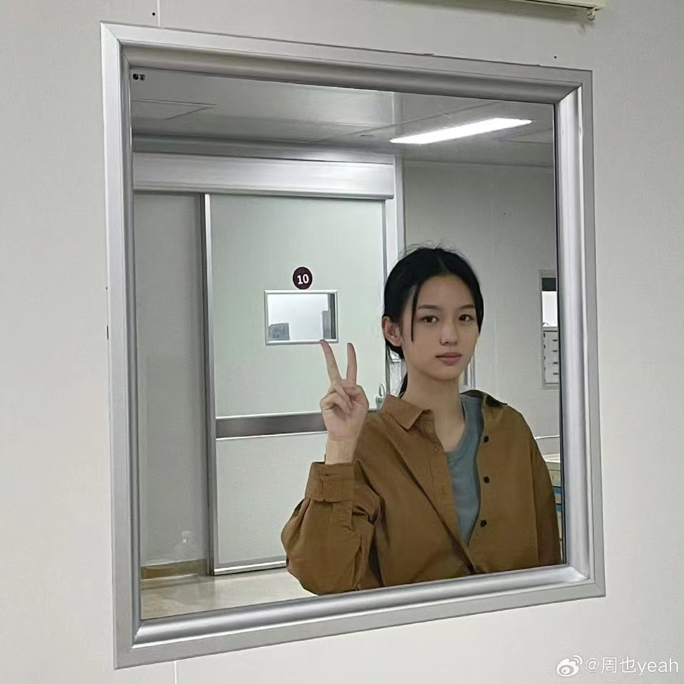

# 😍 目录

1. [电脑选购](dian-nao-xuan-gou.md)
2. [课程时间大致安排](ke-cheng-da-zhi-an-pai.md)
3. [e民大](e-min-da.md)
4. [入学考试](ru-xue-kao-shi.md)
5. [缴费](jiao-fei.md)
6. [宿舍](su-she.md)
7. [洗澡](xi-zao.md)
8. [快递](kuai-di.md)
9. [校园一卡通](xiao-yuan-yi-ka-tong.md)
10. [食堂](shi-tang.md)
11. [军训](jun-xun.md)
12. [校园网](xiao-yuan-wang.md)
13. [计算机专业初学者指南](ji-suan-ji-zhuan-ye-chu-xue-zhe-zhi-nan.md)
14. [寝室供电问题](qin-shi-gong-dian-wen-ti.md)

_<mark style="color:red;">**我知道你们累了，快去看也子的新剧！！！**</mark>_

