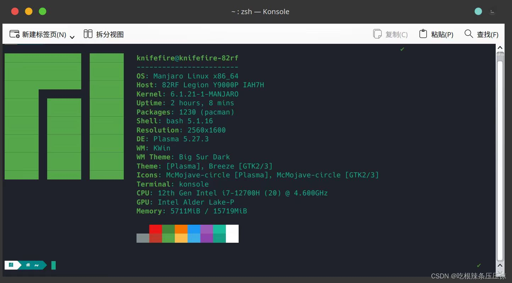

# 电脑选购

计算机相关专业推荐游戏本，游戏本性能更加强悍，剪辑视频，跑深度学习，玩玩swapface，都需要好的独立显卡。

非计算机专业女生推荐轻薄本，游戏本实在是太重啦。

macbook非必要不推荐，除非你是geeker，喜欢美观的界面，喜欢美观字体，那么请选择macbook，我相信它会让你眼前一亮。~~我就有这个想法。~~

本学长使用的是2022款联想拯救者Y9000P，联想品控确实好，我拆开后盖看过，里面的排线布局确实不是二三线品牌能够比拟的。

<figure><figcaption>
我用的LInux，哈哈哈
</figcaption></figure>

在经济允许下，选择一线品牌，品控，售后会好很多。机械革命虽然便宜，但是基本没售后，出问题就要返厂，很麻烦。尽量不买贴牌机。

具体买什么电脑，学长就不啰嗦了，网上有很多帖子，可以去看看。

当然，你也可以找学长组装主机，电脑，手机出问题了也可以找学长。

.jpg>)学长专业维修20年（bushi）哈哈哈
