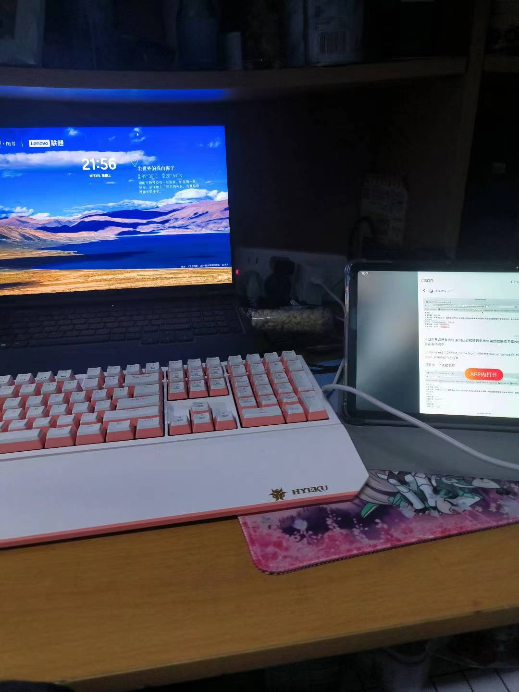
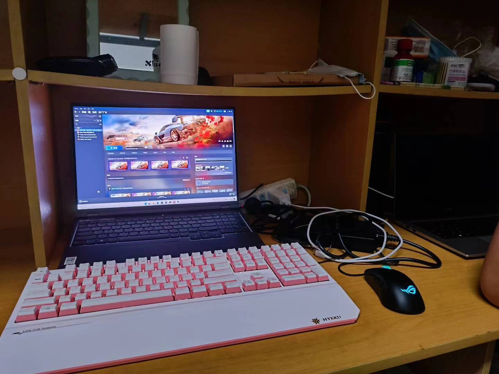

# 宿舍

宿舍名称：宿舍名称按照学校校训来命名，分为博学、博爱、立人、达人四个片区，每个片区都有几栋楼。宿舍命名方式为：片区➕序号，如立人一。

四人寝：立人一、二、五、八，博学全栋（博学全是男生寝室），博爱

&#x20;六人寝：立人三、四、六、七、九、十，达人全栋，博爱&#x20;

PS：立人九、十两栋较为特殊，里面两个宿舍是相通的（不是两栋楼相通），共同一个阳台。

宿舍分配问题：宿舍分配是学院分配，没有固定的分配方式。有的学院20级的在四人寝，21、22级的在六人寝，并且院内有的专业可能在立人区有的专业可能又在达人区。有的院有一定的规律，比如汉语言、法学专业的男生都在博学是四人寝，智能学院的基本上都在达人区是六人寝。

宿舍空间布局 ：四人寝是上床下桌，并且桌子旁边还有柜子，空间较大。 六人寝：有两个大桌子，一个大桌子三个人共用，没有柜子但是门口有一个放行李箱的位置，人多东西多的话会很挤。&#x20;

PS：四人寝比六人寝住宿费贵300。

宿舍卫生检查、安全排查 宿舍卫生检查由本院公管部学生进行定期检查，时间在每周的周二和周四下午五点左右，如有检查人数不足或者其他特殊原因取消检查会有学生会干部在寝室长相应群内通知说明。学校会不定期对宿舍进行安全排查，查收寝室是否有违禁电器等。

