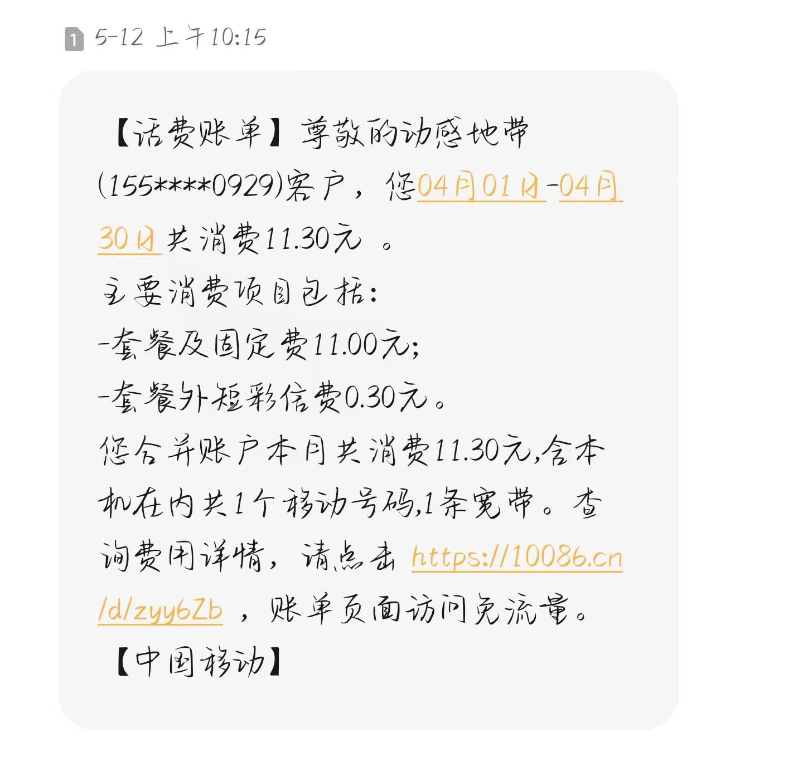
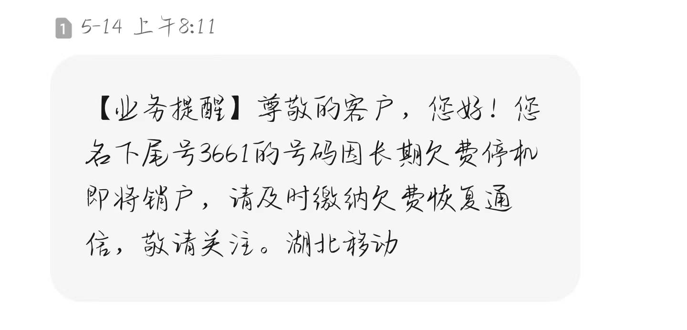

# 校园网

办理：电信 联通 移动 三家任选一家办理SIM卡即可赠送校园网WIFI

资费：三个月150  一学期 200

学长现在每个月资费11元，200G校园流量，30G全国通用流量（通用流量是可以结存至下个月的），300分钟通话时间.

<figure><figcaption></figcaption></figure>

校园WIFI：每位用户支持双终端，一个账号同时在线人数超过两人就会被强制下线。

关于校园卡有个比较坑的点：办理校园SIM卡的时候，店员会给你班两张卡，美其名曰一张是用来给你送会员的（爱奇艺，优酷等等），事实上这个就是店员骗你的，给你办两张卡完全是为了业绩，那张领会员的卡一个月11元，从你主卡上扣，并且那张卡注销不了（~~有办法，但是麻烦~~）。或者几个月不用，自动注销。这是第一个点，第二点就是店员会给你开一些莫名其妙需要付费的功能，这个你打电话问人工客服就好，可以取消。

<figure><figcaption>
长期不使用，自动注销
</figcaption></figure>
